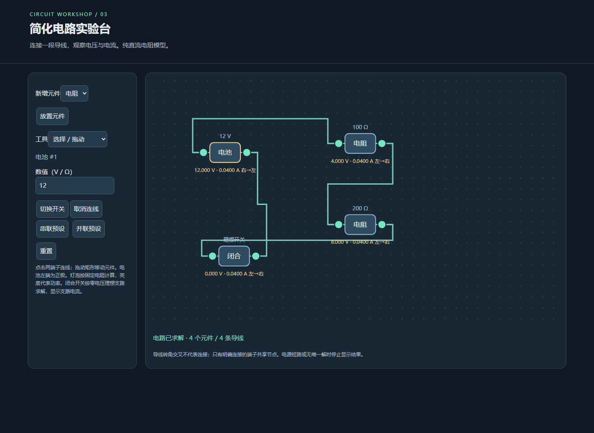

# 简化电路实验台 · GPT-6.1 Sol Low

## 输入与运行条件

[完整归档输入](prompt.md)包含本轮用户指令与 v1 任务正文。使用已有 Codex 会话直接执行，无子代理。模型名称 gpt-6.1-sol 和档位 low 由用户指定；目录与字典使用 gpt-6-1-sol。完整系统及前序会话上下文未归档，输入完整性为 partial。

## 运行

直接打开 [index.html](index.html)，或从仓库静态服务器打开本目录入口。无依赖、无构建、无 CDN、无后端。首次实现保留在 [initial/index.html](initial/index.html)，主入口为验证后的版本。

可编辑的电池、电阻、固定电阻灯泡、开关与端子导线；改进节点分析及高斯消元求解。

## 验证与复盘

自动验收位于 tests/browser/new-static-labs.spec.mjs，覆盖 HTTP 根路径、Pages 子路径、file:// 和 390px 页面布局。检查内容：12V 与 100Ω、200Ω 串联 0.04A；并联 0.12A、0.06A，总电流 0.18A；混合电路、开路、短路、冲突电源、删除和触摸连线。

验证期间将闭合开关改为零电压支路，补全其电流和断开电压；导线改为端子外侧折线，避免被元件遮挡。保留首次版本。

边界：仅简化直流理想元件；冗余理想电源或开关回路导致无唯一解时提示错误。独立悬浮子电路之间的开关电压显示浮置，灯泡按电阻功率映射亮度。导线交叉不会自动连接。

当前会话包含实现及验证后的修复，不是只生成一次的独立盲测。实际追加修复未单独由用户输入，属于本轮自动验证过程；未覆盖其他历史实验。本轮结果仅写入主仓库，未向测试仓库写入实现或实验记录。

## 预览截图

由本实验最终版 `index.html` 在 Chromium 1440 × 1050 桌面视口生成；使用页面默认示例状态截图。
<!-- archive:start -->
## 当前归档信息（自动生成）

- 实验 ID：`circuit-lab--gpt-6-1-sol-low-r01`
- 模型：GPT-6.1 Sol；推理档位：low
- 类型：single-html；预览：static；网络：offline
- [完整原始输入快照](prompt.md) · [主题与其他版本](../../../../topic.html?id=circuit-lab)
- 输入记录：保存用户本轮指令与 v1 原文；在已有会话执行，其他会话及系统上下文未完整留存，不能视为独立盲测。
- 工具：Codex。当前会话直接执行，未委派代理。模型名称 gpt-6.1-sol 与 low 档位由用户明确提供，归档 slug 为 gpt-6-1-sol；不据此推断或修改运行时设置。
- 运行方式：浏览器直接打开本目录入口；CDN/外部素材需要联网。
- 费用记录：OpenAI · ChatGPT Plus 订阅；单案例货币金额未记录。据用户说明，OpenAI 模型通过 ChatGPT Plus 订阅测试；全部案例完成后，五小时额度未耗尽。未提供单案例费用金额。
- [主页面](../../../../demos/circuit-lab/runs/gpt-6-1-sol-low-r01/index.html)

### 部署适配记录

- 保留首次实现于 initial/index.html；后续验证修复在本轮说明中记录。
- 本轮验证修复：用零电压支路求解开关电流，补充断开电压及折线连线显示。
<!-- archive:end -->
