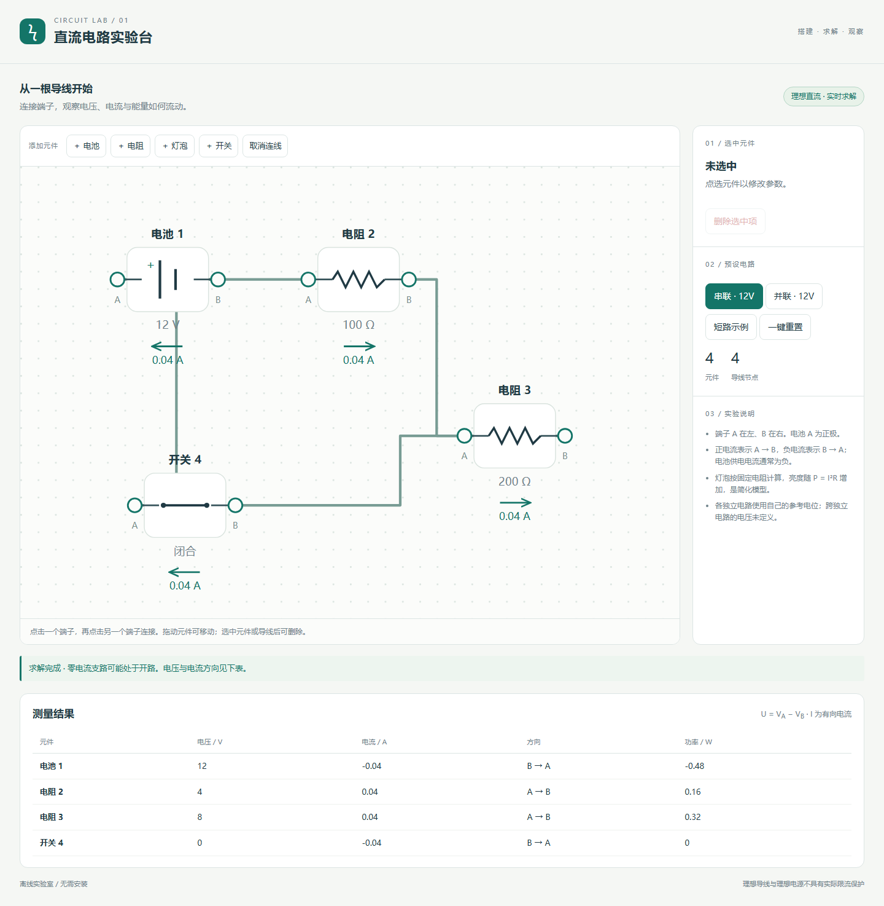

# 直流电路实验台 · gpt-6.1-sol max

可拖动连线的理想直流电路台，采用修正节点分析，提供串并联预设及异常求解提示。

## 输入与运行

[输入记录](prompt.md)保留批量请求及四个任务正文。本案例使用 [v1](../../prompts/v1/prompt.md)，模型与档位由用户提供，四个案例在同一会话中依次完成。系统上下文与工具过程未完全留存，不能视为严格隔离的公平评测。

双击 [index.html](index.html) 可通过 file:// 离线打开；也可在仓库根目录执行 `npm run preview` 后通过主题页进入。无需依赖、CDN、安装或构建。

## 实现与复盘

可拖动连线的理想直流电路台，采用修正节点分析，提供串并联预设及异常求解提示。

[首版产物](iterations/01/index.html)保留检查前的实现，当前入口为本目录 index.html。验证结果与修复记录见下方。

采用导线并查集和分块修正节点分析；闭合开关按零电压约束处理，保留可求解的开关支路电流。每个独立电路单独设置参考电位，跨独立电路的开路开关电压标为未定义。测试确认串联、并联、混合电路、开路、灯泡功率、参数修改、拖动与删除，以及短路、冲突电源和冗余理想回路。灯泡为固定电阻模型，不模拟温度、电池内阻或实际保护电路。

## 验证记录

- Chromium 145.0.7632.6，Headless; --enable-unsafe-swiftshader。
- 桌面 1440 × 1050 与触摸仿真 390 × 844；通过 HTTP 与 file:// 检查。
- 16 项检查通过，原始结果见 [verification.json](verification.json)。
- [桌面截图](evidence-desktop.png) · [移动布局截图](evidence-mobile.png)。
- 可在仓库根目录执行 `node demos/circuit-lab/runs/gpt-6-1-sol-max-r01/verify.mjs` 重跑专项验收；验证工具使用根目录的 @playwright/test，产品 index.html 本身无依赖。

- 12V + 100Ω + 200Ω 串联为 0.04A，元件电压为 4V / 8V
- 并联支路 0.12A / 0.06A，总电流 0.18A
- 通过控件断开开关后电流归零
- 拖动元件保持连接和计算结果
- 删除元件移除关联导线
- 元件参数修改影响求解，非法电阻提示并保留原值
- 电源短路明确提示且不输出有限伪电流
- 混合电路：100Ω 串联两个并联 200Ω，总电流 0.06A
- 相互冲突的理想电源与无唯一解分别提示
- 断开的独立元件无电流且跨独立电路电压未定义
- 灯泡消耗功率由实际电压与电阻计算
- HTTP 页面无脚本错误或外部资源请求
- file:// 可直接打开
- 390px 无页面水平溢出
- 触摸两个端子完成连线
- 移动布局无脚本错误

## 本轮修复

专项检查未发现需要修复的实现问题。

## 预览截图

由本实验最终版 `index.html` 在 Chromium 1440 × 1050 桌面视口生成；使用页面默认示例状态截图。
<!-- archive:start -->
## 当前归档信息（自动生成）

- 实验 ID：`circuit-lab--gpt-6-1-sol-max-r01`
- 模型：GPT-6.1 Sol；推理档位：max
- 类型：single-html；预览：static；网络：offline
- [完整原始输入快照](prompt.md) · [主题与其他版本](../../../../topic.html?id=circuit-lab)
- 输入记录：保留用户批量请求、仓库指令及本会话读取的四个 v1 正文；未完整导出系统/开发者上下文、工具输出与会话内部过程，因此标为 partial。四个案例共享当前会话上下文。
- 工具：Codex。用户指定 gpt-6.1-sol / max，并明确使用当前会话；Windows PowerShell、Node.js v22.16.0。在指定 model-test-base 工作目录中新建实验分支，单代理直接完成，无子代理；未读取远程、其他分支或其他目录的旧实现。纯静态单文件，无构建或外部资源。 无人工改动及追加用户提示；自检修复在 changes 与 iterations 中登记。
- 运行方式：浏览器直接打开本目录入口；CDN/外部素材需要联网。
- [打开实验台](../../../../demos/circuit-lab/runs/gpt-6-1-sol-max-r01/index.html)

### 部署适配记录

- 本轮首次实现；首版源码保存于 iterations/01/index.html。
<!-- archive:end -->
