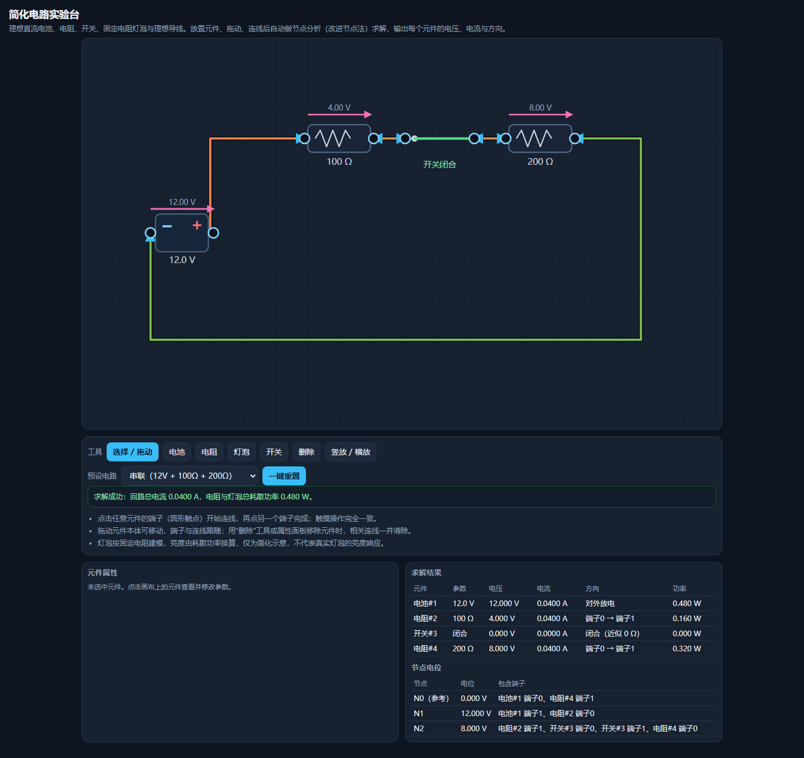

# 简化电路实验台

## 原始提示词

见 [完整原始输入](prompt.md)（与主题任务正文 [v1](../../prompts/v1/prompt.md) 逐字一致，指纹 `33e4966a…`）。

## 运行方式

纯静态单文件，入口 [index.html](index.html)。直接双击打开（`file://`）或放到任意静态服务器均可运行，不请求网络。

- 元件：理想直流电池、电阻、开关、按固定电阻建模的灯泡；端子之间用理想导线连接。
- 求解：并查集把「导线 + 闭合开关」合并为电路节点，再用改进节点法（MNA，带理想电压源约束）解线性方程组，输出每个元件的电压、电流、方向与功率，并列出节点电位。
- 交互：工具栏放置/删除元件，拖动元件移动（端子和连线跟随），点击端子开始连线、再点另一个端子完成；属性面板修改电压/阻值、切换开关、删除元件（相关连线一并清除）。
- 预设电路：串联、并联、开关断开、短路演示、清空画布。
- 异常处理：开路时全部电流为 0 并给出提示；电池被导线短接、两只电池并联但电压不同、方程组奇异时明确说明“无唯一解”并停止求解，不输出 NaN 或伪造的有限电流。

## 验证记录

用 Playwright 驱动真实 Chromium（`file://` 打开）逐条核对任务正文的验收项：

| 验收项 | 实测 |
|---|---|
| 12V 与 100Ω、200Ω 串联 | 回路总电流 0.0400 A，两个电阻同为 0.0400 A |
| 同样电阻并联 | 100Ω 支路 0.1200 A、200Ω 支路 0.0600 A，总电流 0.1800 A |
| 断开开关后相关支路电流为零 | 开关预设下四个元件电流全为 0，提示开路 |
| 短路有明确提示 | 短路预设给出“电池两端被理想导线直接连通…没有唯一解” |
| 移动元件保留连接 | 拖动串联电阻后仍为 0.0400 A |
| 删除元件清除相关连线 | 删除开关后剩余元件不再成环，提示开路，无 NaN |
| 触摸端子可完成连线 | 触摸点两个端子后生成连线，结果表出现两个元件 |
| 390px 无水平溢出 | `scrollWidth == innerWidth == 390` |

## 预览截图

使用 Chromium 在 1440 × 1050 桌面视口中打开最终版 `index.html`，保存完整页面截图。桌面截图：默认串联电路（12V、100Ω 与 200Ω），浏览器结果显示总电流 0.0400 A。

## 复盘

- 选 MNA 而不是手写串并联化简，是因为混合网络下手算组合会爆炸，而节点法天然覆盖任意拓扑。
- 悬空节点会让方程组奇异，这里给每个非参考节点加了 1 GΩ 的对地电阻，物理上等价于开路，数值上把矩阵定住；开路判定用「所有支路电流都小于 1 µA」而不是只看总电流，否则消元残差会让界面在开路时误报“求解成功”。
- 踩过的坑：MNA 里电源电流的定义方向（内部由 + 流向 −）与用户理解的“对外放电”相反，需要取负；元件本体的可见图形会盖在透明命中区上，导致点击总是落到空白；`main` 与 `.grid2` 的 grid 轨道默认 `auto`，被 `white-space:nowrap` 的表格撑到 543px，390px 下横向溢出，需要 `minmax(0,1fr)`。
- 已知限制：灯泡亮度按 `sqrt(P/2)` 线性映射到不透明度，只是耗散功率的可视化示意，不是真实灯泡的光度响应；导线走固定的直角折线，不做避障。

<!-- archive:start -->
## 当前归档信息（自动生成）

- 实验 ID：`circuit-lab--minimax-m3-1-flash-preview-max-r01`
- 模型：MiniMax M3.1 Flash Preview；推理档位：max
- 类型：single-html；预览：static；网络：offline
- [完整原始输入快照](prompt.md) · [主题与其他版本](../../../../topic.html?id=circuit-lab)
- 输入记录：本轮实际收到的任务正文即该主题 prompts/v1/prompt.md 全文，指纹与主题提示词版本一致；会话指令另外指定了本主题、模型 Minimax M3.1 Flash Preview、档位 max，未追加其他要求。
- 工具：Claude Code。模型 Minimax M3.1 Flash Preview（1m 上下文），档位 max，在 model-test-base 分支的当前会话内直接执行，未委派子代理。产物为单文件 index.html，无外部依赖、无网络请求。同一会话内先用 Node 分析复算电路方程，再用 Playwright 驱动真实浏览器逐条核对任务正文的验收数值；发现的缺陷（电源电流符号、颜色表按键名、网格最小宽度导致 390px 溢出、元件命中区被图形遮挡）都在本次会话内由同一模型修正，没有人工介入。
- 运行方式：浏览器直接打开本目录入口；CDN/外部素材需要联网。
- [主页面](../../../../demos/circuit-lab/runs/minimax-m3-1-flash-preview-max-r01/index.html)

### 部署适配记录

无新增实现改动。
<!-- archive:end -->
