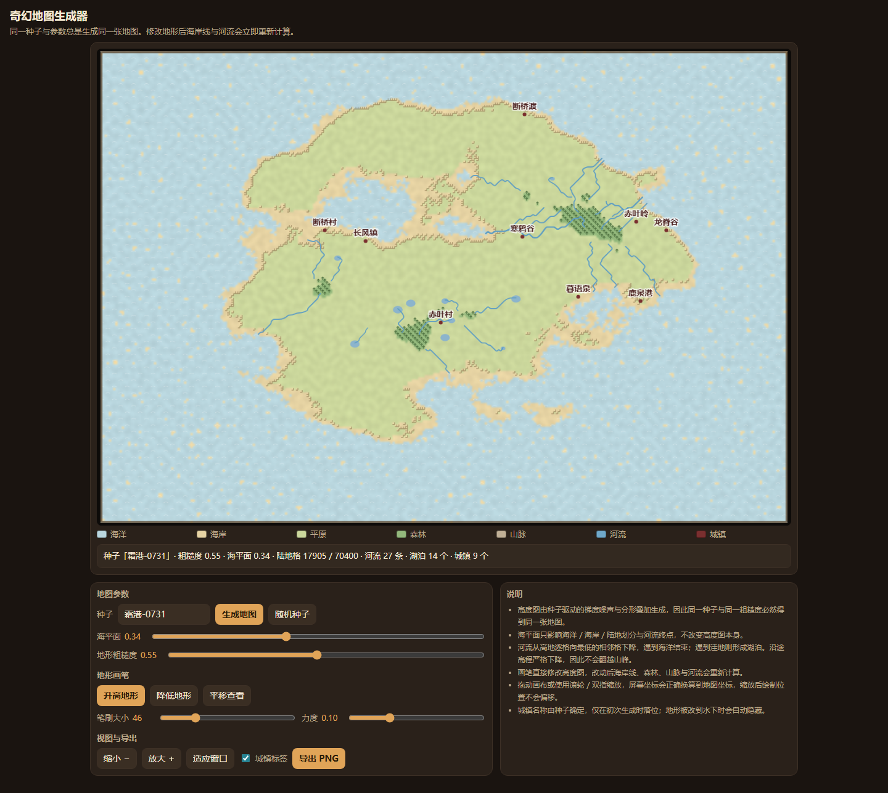

# 奇幻地图生成器

## 原始提示词

见 [完整原始输入](prompt.md)（与主题任务正文 [v1](../../prompts/v1/prompt.md) 逐字一致，指纹 `3760ddfa…`）。

## 运行方式

纯静态单文件，入口 [index.html](index.html)。直接双击打开（`file://`）或放到任意静态服务器均可运行，不请求网络。

- 生成：种子字符串经 FNV-1a 哈希后驱动置换表与 mulberry32 随机数，再用梯度噪声 + 分形叠加 + 脊状噪声生成 320×220 高度图，最后乘以岛屿衰减场。同一种子与同一粗糙度必然得到同一张高度图。
- 地形：海洋 / 海岸 / 平原 / 森林 / 山脉五类，按海平面与高程划分；海岸线叠加一层噪声抖动，避免出现像素锯齿状直边。
- 河流：从高地逐格走向最低的相邻格（局部平坦时放宽到半径 2、3），高程严格下降，遇到海洋结束，遇到洼地形成湖泊，因此不会翻越山峰。画笔改动后立即重算。
- 交互：升高/降低画笔（可调笔刷大小与力度）、平移、滚轮与双指缩放、城镇标签开关、PNG 导出（含标题、种子与图例）。
- 首屏即为可操作的默认地图「霜港-0731」，并带图例与统计（陆地格数、河流条数、湖泊数、城镇数）。

## 验证记录

用 Playwright 驱动真实 Chromium（`file://` 打开）逐条核对任务正文的验收项：

| 验收项 | 实测 |
|---|---|
| 相同种子重生成结果一致 | 两次生成的画布 dataURL 完全相同；换种子再换回来也一致 |
| 改变种子产生不同地图 | 换种子后画布指纹不同 |
| 画笔确实修改地形并联动地图 | 一次拖笔后陆地格 17905 → 18111，河流 27 → 39 条 |
| 缩放后绘制坐标正确 | 放大两档后继续绘制，地形统计仍按预期变化 |
| 导出图片包含当前地图 | 点击导出触发 PNG 下载 `fantasy-map-__-0731.png` |
| 触摸操作可用 | 390px 视口无水平溢出，触摸绘制生效 |
| 首屏可操作默认地图与图例 | 默认种子「霜港-0731」：陆地 17905/70400 格、河流 27 条、湖泊 14 个、城镇 9 个 |

## 预览截图

使用 Chromium 在 1440 × 1050 桌面视口中打开最终版 `index.html`，保存完整页面截图。桌面截图：默认种子“霜港-0731”的地图、地形图例与编辑控件。

## 复盘

- 渲染分两层：320×220 的 `ImageData` 底图（每次地形变化重算，约 2 ms）铺到 4 倍的场景画布上，再叠加海浪、树木、山峰、河流、城镇等矢量细节，只在地图变化时重建，缩放平移时只做一次 `drawImage`。
- 踩过的坑：调色板最初写成 `{ocean:[…]}` 却用数字索引取值，直接抛异常使整页不显示；河流追踪复用了外层扫描循环的 `x`/`y` 变量，一次回溯把扫描位置倒推回去，形成死循环并把内存撑爆；城镇选址读的是上一轮的 `rivers`，导致同一个种子两次生成结果不同；高程上限只有 0.60，整张图没有山脉，把陆地基线和山脊权重调高后才有五级地形。
- 已知限制：高度图固定 320×220，导出图片就是场景画布的原始分辨率；河流是格点折线（用中点二次曲线做了平滑），不是水文模型。

<!-- archive:start -->
## 当前归档信息（自动生成）

- 实验 ID：`fantasy-map-generator--minimax-m3-1-flash-preview-max-r01`
- 模型：MiniMax M3.1 Flash Preview；推理档位：max
- 类型：single-html；预览：static；网络：offline
- [完整原始输入快照](prompt.md) · [主题与其他版本](../../../../topic.html?id=fantasy-map-generator)
- 输入记录：本轮实际收到的任务正文即该主题 prompts/v1/prompt.md 全文，指纹与主题提示词版本一致；会话指令另外指定了本主题、模型 Minimax M3.1 Flash Preview、档位 max，未追加其他要求。
- 工具：Claude Code。模型 Minimax M3.1 Flash Preview（1m 上下文），档位 max，在 model-test-base 分支的当前会话内直接执行，未委派子代理。产物为单文件 index.html，无外部依赖、无网络请求。同一会话内先用 Node 复算地形与河流算法定位死循环与越界，再在真实浏览器中核对同种子可重复性、画笔联动、缩放坐标与导出。缺陷（颜色表使用字符串键被数字索引、河流追踪改写了外层扫描计数器导致死循环、城镇选址读到上一轮河流、高程分布过偏低无山脉）都在本次会话内由同一模型修正。
- 运行方式：浏览器直接打开本目录入口；CDN/外部素材需要联网。
- [主页面](../../../../demos/fantasy-map-generator/runs/minimax-m3-1-flash-preview-max-r01/index.html)

### 部署适配记录

无新增实现改动。
<!-- archive:end -->
