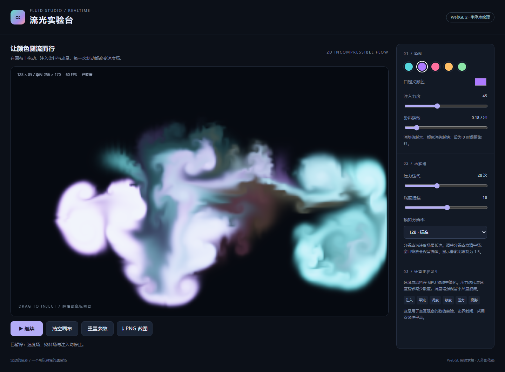

# 彩色流体实验台 · gpt-6.1-sol max

半浮点 GPU 纹理中的二维流体模拟，包含平流、压力迭代、速度投影与涡度增强。

## 输入与运行

[输入记录](prompt.md)保留批量请求及四个任务正文。本案例使用 [v1](../../prompts/v1/prompt.md)，模型与档位由用户提供，四个案例在同一会话中依次完成。系统上下文与工具过程未完全留存，不能视为严格隔离的公平评测。

双击 [index.html](index.html) 可通过 file:// 离线打开；也可在仓库根目录执行 `npm run preview` 后通过主题页进入。无需依赖、CDN、安装或构建。

## 实现与复盘

半浮点 GPU 纹理中的二维流体模拟，包含平流、压力迭代、速度投影与涡度增强。

[首版产物](iterations/01/index.html)保留检查前的实现，当前入口为本目录 index.html。验证结果与修复记录见下方。

WebGL 2 使用 RGBA16F，WebGL 1 使用受支持的半浮点纹理；实际检查 framebuffer 可渲染性。速度和染料双缓冲，使用手动双线性平流、涡度增强、散度、Jacobi 压力迭代和投影。重建释放全部旧 texture/framebuffer，窗口缩放通过 GPU 复制保留场。检查包括读取真实 GPU 场、降低散度、消散与压力参数、暂停、清空、PNG 像素、WebGL 1 降级、缺少支持的提示及上下文恢复。浏览器证据来自 Chromium 软件渲染及触摸仿真，不作为实体移动设备或性能评测结果。

## 验证记录

- Chromium 145.0.7632.6，Headless; --enable-unsafe-swiftshader。
- 桌面 1440 × 1050 与触摸仿真 390 × 844；通过 HTTP 与 file:// 检查。
- 19 项检查通过，原始结果见 [verification.json](verification.json)。
- [桌面截图](evidence-desktop.png) · [移动布局截图](evidence-mobile.png)。
- 可在仓库根目录执行 `node demos/fluid-simulation/runs/gpt-6-1-sol-max-r01/verify.mjs` 重跑专项验收；验证工具使用根目录的 @playwright/test，产品 index.html 本身无依赖。

- WebGL 2 半浮点纹理与求解程序成功初始化
- 暂停冻结画面，拖动也不注入
- 清空移除速度、染料与压力场
- 注入动量进入真实速度纹理且方向正确
- 压力迭代和速度投影降低速度场散度
- 压力迭代参数决定实际 GPU 压力 pass 次数
- 染料随平流演化，消散参数改变染料衰减
- 分辨率重建清空场并释放旧纹理及 framebuffer
- 窗口尺寸变化保留染料且释放被替换的 GPU 资源
- PNG 截图下载且包含当前画布
- 真实鼠标拖动注入染料，颜色与力度控件可修改
- 缺少 WebGL 或半浮点渲染扩展时显示明确错误
- WebGL 1 降级路径可运行
- GPU 上下文丢失有提示且恢复后可继续
- HTTP 页面无脚本错误或外部资源请求
- file:// 可直接打开
- 390px 无页面水平溢出
- 移动布局下触摸注入且 WebGL 正常
- 移动布局无脚本错误

## 本轮修复

专项检查未发现需要修复的实现问题。

## 预览截图

由本实验最终版 `index.html` 在 Chromium 1440 × 1050 桌面视口生成；流体案例先注入双色笔迹并暂停，以展示交互后的模拟画面。
<!-- archive:start -->
## 当前归档信息（自动生成）

- 实验 ID：`fluid-simulation--gpt-6-1-sol-max-r01`
- 模型：GPT-6.1 Sol；推理档位：max
- 类型：single-html；预览：static；网络：offline
- [完整原始输入快照](prompt.md) · [主题与其他版本](../../../../topic.html?id=fluid-simulation)
- 输入记录：保留用户批量请求、仓库指令及本会话读取的四个 v1 正文；未完整导出系统/开发者上下文、工具输出与会话内部过程，因此标为 partial。四个案例共享当前会话上下文。
- 工具：Codex。用户指定 gpt-6.1-sol / max，并明确使用当前会话；Windows PowerShell、Node.js v22.16.0。在指定 model-test-base 工作目录中新建实验分支，单代理直接完成，无子代理；未读取远程、其他分支或其他目录的旧实现。纯静态单文件，无构建或外部资源。 无人工改动及追加用户提示；自检修复在 changes 与 iterations 中登记。
- 运行方式：浏览器直接打开本目录入口；CDN/外部素材需要联网。
- 费用记录：OpenAI · ChatGPT Plus 订阅；单案例货币金额未记录。据用户说明，OpenAI 模型通过 ChatGPT Plus 订阅测试；全部案例完成后，五小时额度未耗尽。未提供单案例费用金额。
- [打开实验台](../../../../demos/fluid-simulation/runs/gpt-6-1-sol-max-r01/index.html)

### 部署适配记录

- 本轮首次实现；首版源码保存于 iterations/01/index.html。
<!-- archive:end -->
