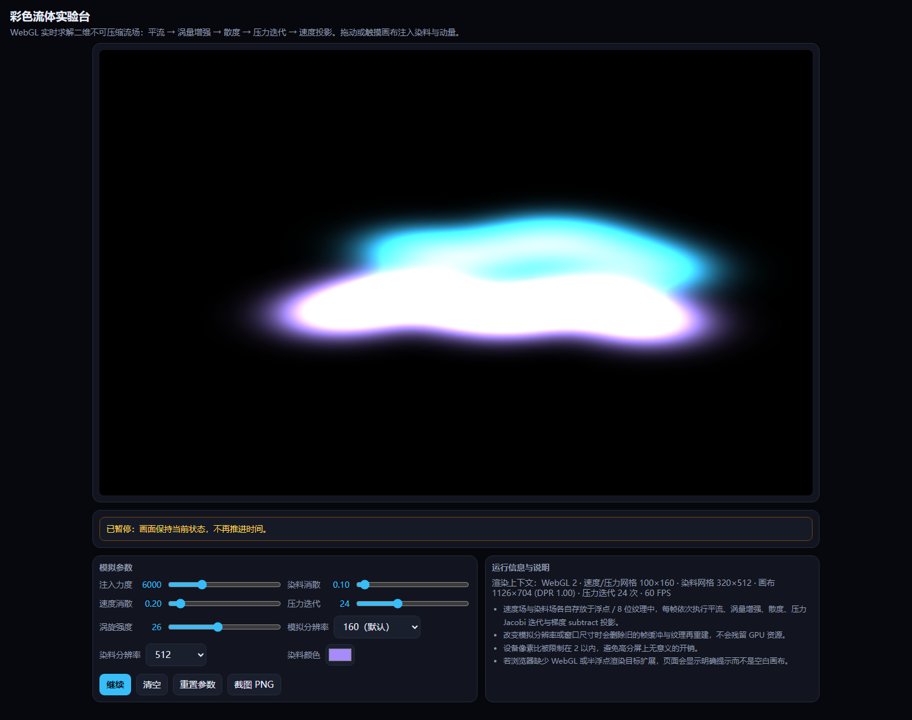

# 彩色流体实验台

## 原始提示词

见 [完整原始输入](prompt.md)（与主题任务正文 [v1](../../prompts/v1/prompt.md) 逐字一致，指纹 `12a551f3…`）。

## 运行方式

纯静态单文件，入口 [index.html](index.html)。直接双击打开（`file://`）或放到任意静态服务器均可运行，不请求网络。

- 求解：WebGL2（不可用时回退 WebGL1）上的二维不可压缩流场求解器，每帧依次执行涡量 → 涡量增强 → 散度 → 压力 Jacobi 迭代（次数可调）→ 减去压力梯度投影 → 速度场自平流 → 染料场平流。速度、压力、散度、涡量用半浮点纹理，染料用 8 位纹理；平流的双线性插值在着色器里手写，不依赖浮点纹理线性过滤扩展。
- 交互：鼠标或触摸拖动注入染料与动量，拖动方向决定流向；染料颜色、注入力度、染料消散、速度消散、压力迭代次数、涡旋强度、模拟分辨率、染料分辨率全部实时生效；暂停/继续、清空、重置参数、PNG 截图。
- 资源管理：改变分辨率或窗口尺寸时先删除旧的纹理与帧缓冲再重建；设备像素比上限 2。
- 兼容处理：启动时检查 WebGL 上下文与半浮点渲染目标扩展，缺失时在画布位置显示明确的中文提示而不是空白页；`webglcontextlost` / `webglcontextrestored` 均有处理，恢复后重建全部着色器与缓冲。

## 验证记录

本机无头 Chromium 的 WebGL 画布不会合成进页面截图——连最简单的 `gl.clearColor` 页面截图仍是白底、`toDataURL` 也不反映绘制内容，因此**画面观感无法在本机核对**。改为在页面内临时加探针，从帧缓冲 GPU 回读染料场与速度场逐条验证，验证后探针已从正式产物中移除（正式 index.html 不含任何调试代码）。

| 验收项 | 实测（GPU 回读） |
|---|---|
| 拖动方向影响流动 | 向右拖与向左拖得到不同的染料场指纹 |
| 染料与速度随时间演化 | 拖动后 0.8 s 染料场指纹持续变化 |
| 参数变化影响计算 | 染料消散 3.0 时回读峰值 21，设为 0 时为 386 |
| 暂停后画面停止演化 | 暂停前后两次回读指纹完全相同，继续后恢复变化 |
| 清空移除已有流体内容 | 染料场与速度场回读值均为 0 |
| 截图可下载 | 点击后触发 PNG 下载 |
| 不支持 WebGL 时不出现空白页 | 缺扩展时画布位置显示中文原因说明（本机环境支持，故走正常路径） |
| 移动端运行且无水平溢出 | 390px 视口 `scrollWidth == 390`，三次触摸注入后染料场发生变化 |
| 模拟分辨率切换 | 切到 320 后速度/压力网格由 100×160 变为 200×320，上下文未丢失、无 GL 错误 |

## 预览截图

使用 Chromium 在 1440 × 1050 桌面视口中打开最终版 `index.html`，保存完整页面截图。桌面截图：将染料消散设为 0.10，拖动注入青色与紫色染料和动量，暂停后截图。

## 复盘

- 三个真实缺陷都是靠回读数据而不是看截图发现的：速度与染料的分辨率对象只存了 `w`/`h`，`texel` 是 `undefined`，于是所有通道的 `texelSize` 变成 NaN，第一帧就把染料场清成全零（页面表现为纯黑）；染料和速度一度用同一张纹理既当渲染目标又当采样源，形成反馈回路，ANGLE 直接丢弃上下文；上下文恢复后旧的 program 全部失效，原实现只重建了缓冲。
- 注入改用加法混合（`ONE, ONE`）而不是“读回目标再相加”，从根上消除反馈回路，也省掉一次纹理采样。
- 已知限制：固定步长取 `min(dt, 1/30)`，页面卡顿时模拟时间会慢于真实时间；染料是 8 位纹理，强注入叠加后容易削顶；压力用 Jacobi 迭代，24 次迭代对大涡流并非完全收敛。

<!-- archive:start -->
## 当前归档信息（自动生成）

- 实验 ID：`fluid-simulation--minimax-m3-1-flash-preview-max-r01`
- 模型：MiniMax M3.1 Flash Preview；推理档位：max
- 类型：single-html；预览：static；网络：offline
- [完整原始输入快照](prompt.md) · [主题与其他版本](../../../../topic.html?id=fluid-simulation)
- 输入记录：本轮实际收到的任务正文即该主题 prompts/v1/prompt.md 全文，指纹与主题提示词版本一致；会话指令另外指定了本主题、模型 Minimax M3.1 Flash Preview、档位 max，未追加其他要求。
- 工具：Claude Code。模型 Minimax M3.1 Flash Preview（1m 上下文），档位 max，在 model-test-base 分支的当前会话内直接执行，未委派子代理。产物为单文件 index.html，无外部依赖、无网络请求。本机无头 Chromium 的 WebGL 画布不会合成到页面截图（连最简单的 gl.clear 也只显示白底），因此画面效果无法用截图核对。改为在页面内加临时探针从帧缓冲 GPU 回读染料场与速度场，逐条验证注入、演化、方向、暂停、清空与参数生效，验证后探针已从正式产物中移除。缺陷（速度/染料纹理的 texel 尺寸为 undefined 使所有求解通道得到 NaN、同一纹理既作渲染目标又作采样源形成反馈回路导致上下文丢失、上下文恢复后未重建着色器）都在本次会话内由同一模型修正。
- 运行方式：浏览器直接打开本目录入口；CDN/外部素材需要联网。
- [主页面](../../../../demos/fluid-simulation/runs/minimax-m3-1-flash-preview-max-r01/index.html)

### 部署适配记录

无新增实现改动。
<!-- archive:end -->
