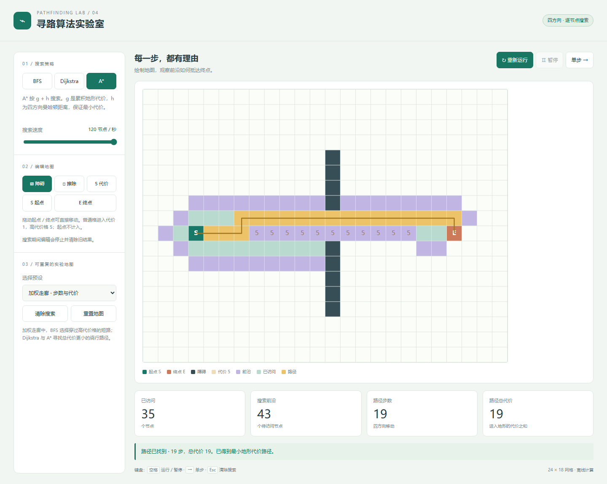

# 寻路算法实验室 · gpt-6.1-sol max

可编辑加权网格中的 BFS、Dijkstra 与曼哈顿 A*，支持运行、暂停和逐节点单步。

## 输入与运行

[输入记录](prompt.md)保留批量请求及四个任务正文。本案例使用 [v1](../../prompts/v1/prompt.md)，模型与档位由用户提供，四个案例在同一会话中依次完成。系统上下文与工具过程未完全留存，不能视为严格隔离的公平评测。

双击 [index.html](index.html) 可通过 file:// 离线打开；也可在仓库根目录执行 `npm run preview` 后通过主题页进入。无需依赖、CDN、安装或构建。

## 实现与复盘

可编辑加权网格中的 BFS、Dijkstra 与曼哈顿 A*，支持运行、暂停和逐节点单步。

[首版产物](iterations/01/index.html)保留检查前的实现，当前入口为本目录 index.html。验证结果与修复记录见下方。

BFS 使用先进先出队列；Dijkstra / A* 使用带过期项过滤的二叉最小堆。四方向移动，曼哈顿启发式，进入普通格为 1、高代价格为 5，起点不计入。每次单步只展开一个有效节点，编辑会停止并清除搜索。加权走廊 BFS 得到 17 步 / 61 代价，Dijkstra 与 A* 均得到 19 代价。高代价与障碍可绘制，起终点不能被覆盖。

## 验证记录

- Chromium 145.0.7632.6，Headless; --enable-unsafe-swiftshader。
- 桌面 1440 × 1050 与触摸仿真 390 × 844；通过 HTTP 与 file:// 检查。
- 13 项检查通过，原始结果见 [verification.json](verification.json)。
- [桌面截图](evidence-desktop.png) · [移动布局截图](evidence-mobile.png)。
- 可在仓库根目录执行 `node demos/pathfinding-lab/runs/gpt-6-1-sol-max-r01/verify.mjs` 重跑专项验收；验证工具使用根目录的 @playwright/test，产品 index.html 本身无依赖。

- 空白网格三种算法均返回 17 步、代价 17 的四方向路径
- 加权地图 BFS 为 17 步 / 61 代价，Dijkstra 与 A* 均为 19 代价
- 封闭终点不可达且前沿耗尽
- 起点位于高代价格时起点代价仍不计入
- 单步展开一个节点，暂停后不继续搜索
- 编辑正在运行的地图停止并清除旧搜索
- 擦除和高代价格工具生效，起终点不可被障碍覆盖
- 拖动起点更新位置，重置重新加载相同预设
- HTTP 页面无脚本错误或外部资源请求
- file:// 可直接打开
- 390px 无页面水平溢出
- 触摸编辑障碍与移动起点
- 移动布局无脚本错误

## 本轮修复

- 浏览器检查后补充显式网格底色，增强空白格边界的可见性。首版源码保留在 iterations/01/index.html。

## 预览截图

由本实验最终版 `index.html` 在 Chromium 1440 × 1050 桌面视口生成；寻路案例以最高演示速度运行至搜索结束后截图。
<!-- archive:start -->
## 当前归档信息（自动生成）

- 实验 ID：`pathfinding-lab--gpt-6-1-sol-max-r01`
- 模型：GPT-6.1 Sol；推理档位：max
- 类型：single-html；预览：static；网络：offline
- [完整原始输入快照](prompt.md) · [主题与其他版本](../../../../topic.html?id=pathfinding-lab)
- 输入记录：保留用户批量请求、仓库指令及本会话读取的四个 v1 正文；未完整导出系统/开发者上下文、工具输出与会话内部过程，因此标为 partial。四个案例共享当前会话上下文。
- 工具：Codex。用户指定 gpt-6.1-sol / max，并明确使用当前会话；Windows PowerShell、Node.js v22.16.0。在指定 model-test-base 工作目录中新建实验分支，单代理直接完成，无子代理；未读取远程、其他分支或其他目录的旧实现。纯静态单文件，无构建或外部资源。 无人工改动及追加用户提示；自检修复在 changes 与 iterations 中登记。
- 运行方式：浏览器直接打开本目录入口；CDN/外部素材需要联网。
- 费用记录：OpenAI · ChatGPT Plus 订阅；单案例货币金额未记录。据用户说明，OpenAI 模型通过 ChatGPT Plus 订阅测试；全部案例完成后，五小时额度未耗尽。未提供单案例费用金额。
- [打开实验台](../../../../demos/pathfinding-lab/runs/gpt-6-1-sol-max-r01/index.html)

### 部署适配记录

- 本轮首次实现；首版源码保存于 iterations/01/index.html。
- 浏览器检查后补充显式网格底色，增强空白格边界的可见性。首版源码保留在 iterations/01/index.html。
<!-- archive:end -->
