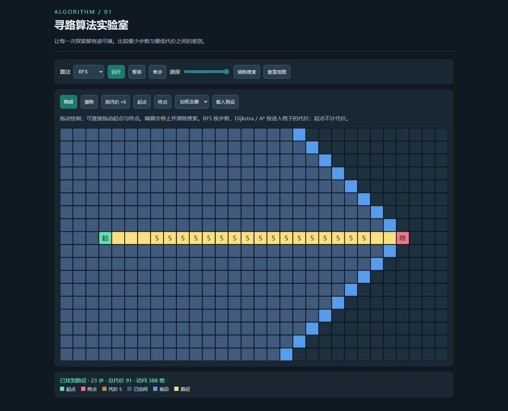

# pathfinding-lab · GPT 6 Astra Low

支持 BFS、Dijkstra、A* 的可编辑加权网格与逐步搜索。

## 输入与运行

[完整输入](prompt.md)，任务正文 v1。模型与档位由用户指定为 gpt-6-astra / low。本轮四个案例在同一当前会话顺序完成，无子代理；用户明确允许沿用当前会话。输入完整性标记 partial，因为未逐字归档系统与工具上下文。

直接打开 [index.html](index.html)，或在仓库根运行 npm run preview 后访问本目录。不需要网络或构建。

## 首次产物与修复

[first-output/index.html](first-output/index.html) 为浏览器验收前快照；后续验证与修复另行记录，不覆盖该快照。无人工修改。

## 验证与局限

加权走廊 BFS 得到 23 步、代价 91；Dijkstra 与 A* 均得到最小代价 25；封闭终点不可达；单步一次只访问一格，暂停不演化，编辑清除旧搜索，触摸编辑通过。四方向固定 30×18 网格，不提供对角线或大规模性能评测。

验证覆盖 HTTP 根路径、Pages 子路径、file:// 直接打开与 390px 无水平溢出；浏览器为 Playwright Chromium，流体测试启用软件 WebGL。测试脚本：tests/browser/astra-low-labs.spec.mjs。

[桌面运行截图](preview.png)。截图为操作后的界面，不是生成器输入。

验收中未修改案例源码，index.html 与首次快照一致。测试代码修正了并联预设导线数断言（实际为 5），并为既有首页回归补上分页加载步骤；没有修改站点交互。

## 预览截图

由本实验最终版 `index.html` 在 Chromium 1440 × 1050 桌面视口生成；寻路案例以最高演示速度运行至搜索结束后截图。
<!-- archive:start -->
## 当前归档信息（自动生成）

- 实验 ID：`pathfinding-lab--gpt-6-astra-low-r01`
- 模型：GPT-6 Astra；推理档位：low
- 类型：single-html；预览：static；网络：offline
- [完整原始输入快照](prompt.md) · [主题与其他版本](../../../../topic.html?id=pathfinding-lab)
- 输入记录：保存本轮用户原文与实际读取的 v1 任务全文；系统/开发者上下文及完整工具交互未逐字归档，因此为 partial。
- 工具：Codex。模型名称 gpt-6-astra、档位 low 由用户明确指定。按用户要求沿用当前会话与当前工作目录，未创建新克隆或新会话；顺序独立执行，未使用子代理。未读取其他分支、远程或其他工作目录的历史实现。
- 运行方式：浏览器直接打开本目录入口；CDN/外部素材需要联网。
- 费用记录：OpenAI · ChatGPT Plus 订阅；单案例货币金额未记录。据用户说明，OpenAI 模型通过 ChatGPT Plus 订阅测试；全部案例完成后，五小时额度未耗尽。未提供单案例费用金额。
- [实验台](../../../../demos/pathfinding-lab/runs/gpt-6-astra-low-r01/index.html)

### 部署适配记录

- 本轮首次实现；first-output/index.html 保留进入浏览器验收前的首份产物。
<!-- archive:end -->
