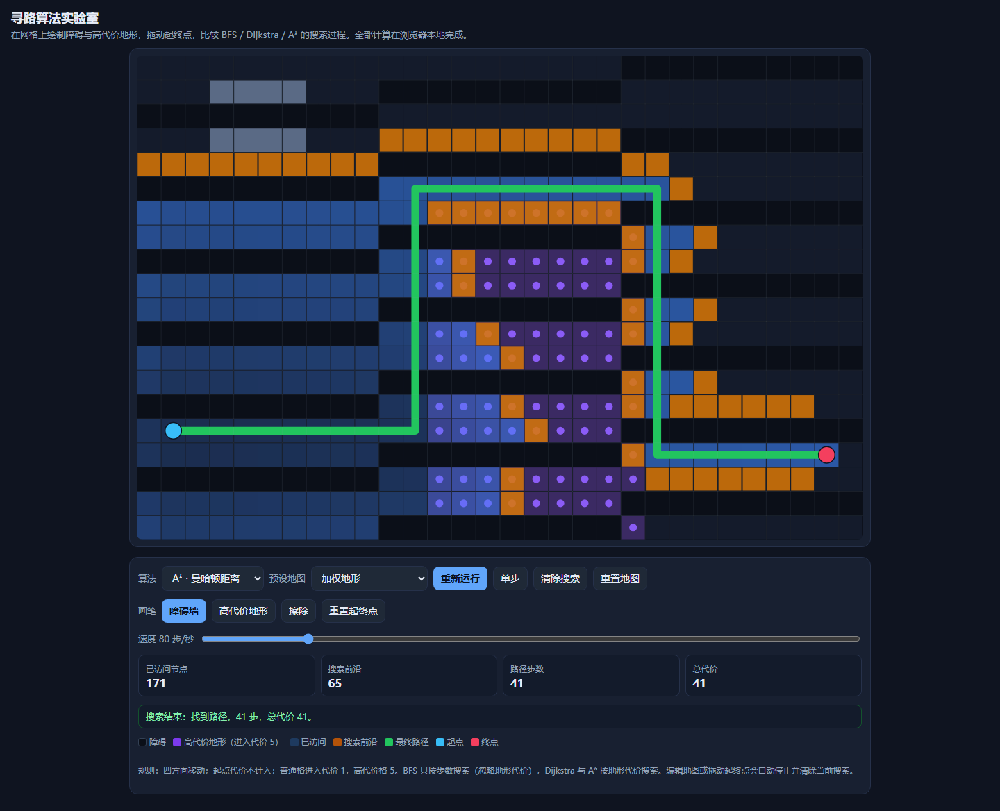

# 寻路算法实验室

## 原始提示词

见 [完整原始输入](prompt.md)（与主题任务正文 [v1](../../prompts/v1/prompt.md) 逐字一致，指纹 `b8d223f9…`）。

## 运行方式

纯静态单文件，入口 [index.html](index.html)。直接双击打开（`file://`）或放到任意静态服务器均可运行，不请求网络。

- 算法：BFS（四方向，按步数）、Dijkstra（四方向，按地形代价）、A*（四方向，曼哈顿距离）。
- 地形：障碍（不可进入）、高代价格（进入代价 5），普通格进入代价 1，起点代价不计入。
- 交互：画笔绘制/擦除地形，直接拖动起点与终点；运行、暂停、单步、速度 2–500 步/秒、清除搜索、重置地图。
- 编辑地图或拖动起终点会自动停止并清除当前搜索，避免新旧状态混用。
- 预设地图：空旷网格、迷宫（带缺口）、加权地形、蛇形走廊、封闭终点（不可达）。

## 验证记录

用 Playwright 驱动真实 Chromium（`file://` 打开）逐条核对任务正文的验收项：

| 验收项 | 实测 |
|---|---|
| 无障碍网格路径正确 | A* 在空旷网格上 27 步、总代价 27 |
| 封闭终点明确显示不可达 | 预设「封闭终点」提示“终点不可达”，已访问 425 个节点 |
| Dijkstra 与 A* 最小代价相同 | 加权地形上两者均为 41 |
| BFS 展示步数最少路径 | 同图 BFS 为 27 步（代价 63），确实少于 Dijkstra 的 41 步 |
| 暂停与单步真实控制 | 暂停后节点数不再增长；单步恰好 +1 |
| 起终点不可被障碍覆盖 | 在起点格绘制障碍不生效 |
| 移动端可编辑 | 390px 视口无水平溢出，触摸绘制正常 |
| 清除搜索 | 已访问数与路径统计归零，地图保留 |

## 预览截图

使用 Chromium 在 1440 × 1050 桌面视口中打开最终版 `index.html`，保存完整页面截图。桌面截图：选择加权地形并运行 A*，完成后显示 41 步、总代价 41。

## 复盘

- 网格固定 30×20，画布用 `ResizeObserver` + 设备像素比适配；速度默认 80 步/秒，否则整图不可达搜索需要半分钟才跑完。
- 前沿用「线性扫描取最小 f」的优先队列：网格只有 600 格，实现简单且能正确处理重复入队。
- 踩过的坑：弹出优先队列时会把节点从 `frontier` 里删掉，回溯路径时若再从 `frontier` 取前驱就断链，因此把前驱与访问顺序一起存进 `closed`；加权预设最初的高代价条带太窄，三种算法结果完全一样，看不出差别，改成 9 列宽的条带后才体现“步数最少”和“总代价最小”的分歧。
- 已知限制：四方向移动，没有对角线；速度上限 500 步/秒。

<!-- archive:start -->
## 当前归档信息（自动生成）

- 实验 ID：`pathfinding-lab--minimax-m3-1-flash-preview-max-r01`
- 模型：MiniMax M3.1 Flash Preview；推理档位：max
- 类型：single-html；预览：static；网络：offline
- [完整原始输入快照](prompt.md) · [主题与其他版本](../../../../topic.html?id=pathfinding-lab)
- 输入记录：本轮实际收到的任务正文即该主题 prompts/v1/prompt.md 全文，指纹与主题提示词版本一致；会话指令另外指定了本主题、模型 Minimax M3.1 Flash Preview、档位 max，未追加其他要求。
- 工具：Claude Code。模型 Minimax M3.1 Flash Preview（1m 上下文），档位 max，在 model-test-base 分支的当前会话内直接执行，未委派子代理。产物为单文件 index.html，无外部依赖、无网络请求。同一会话内先在 Node 中推演加权地图的期望代价，再在真实浏览器中核对三种算法的路径步数与总代价、暂停/单步、编辑清空与触摸绘制。缺陷（回溯时从已被弹出队列的节点取前驱导致路径只剩一个格子、运行按钮未初始化搜索、加权预设无法体现 BFS 与最小代价的差异）都在本次会话内由同一模型修正。
- 运行方式：浏览器直接打开本目录入口；CDN/外部素材需要联网。
- [主页面](../../../../demos/pathfinding-lab/runs/minimax-m3-1-flash-preview-max-r01/index.html)

### 部署适配记录

无新增实现改动。
<!-- archive:end -->
