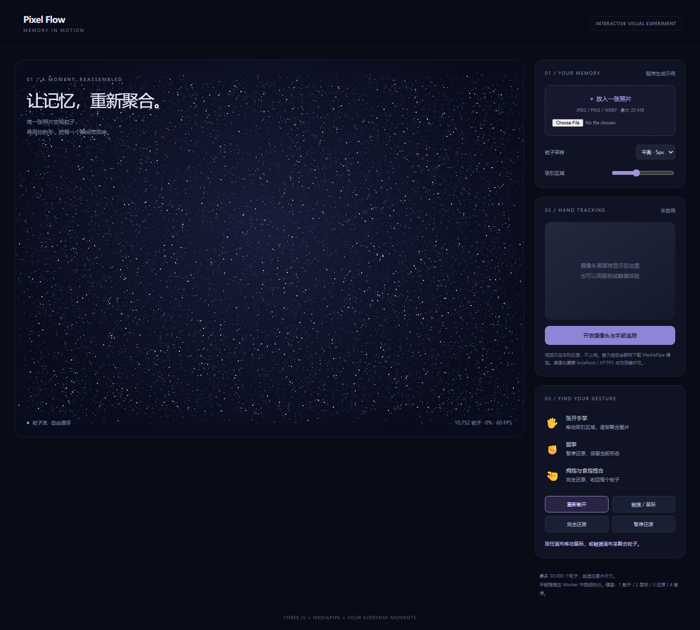

# Pixel Flow · 手势图片重构

## 本轮来源

用户指定 **gpt-6.1-sol / max**，明确允许当前会话。当前助手顺序执行，无子代理；模型名称来源为用户。完整用户要求与本题原文见 [prompt.md](prompt.md)。系统完整上下文、前序工具输出和历史缺失的材料未导出，输入标记 partial。

[批次说明](../../../../docs/experiments/gpt-6-1-sol-max/Readme.md) · [校验记录](../../../../docs/experiments/gpt-6-1-sol-max/validation.md) · [校验前首轮完整源码快照](../../../../docs/experiments/gpt-6-1-sol-max/first-complete-sources.zip)

这是一次当前会话的实现记录，不能视作独立会话下的公平性能评测。没有人工修改，所有实现期修复由当前助手完成。

## 功能

上传本地图片（最大 20 MB），Canvas 提取颜色和目标位置；采样可调且最多 30,000 粒子，初始为随机动态粒子流。张开手掌激活随手移动的吸引区域，握拳暂停，捏合完全还原；按钮、鼠标与触摸提供同样可用的重构路径。

Three.js r160 管理 Points 与 shader。MediaPipe Tasks Vision 0.10.21 的 HandLandmarker 输出 21 个手部关键点，经典 Worker 内运行 CPU 推理（最多约 12.5 次/秒），用 ImageBitmap 传递帧。模型和 WASM 从固定 CDN 地址加载。实时摄像头及骨架以镜像呈现，坐标与力场相同。帧与视频均在本机处理。

## 运行

[index.html](index.html) 可直接打开体验图片和鼠标；摄像头建议通过 localhost / HTTPS：

```sh
# 仓库根目录
npm run preview
```

摄像头在点击开启之后请求权限；关闭、失败和页面离开均停止媒体轨道、终止 Worker。无设备、拒绝权限、模型失败有状态提示。Three.js、MediaPipe 与模型需要联网，本记录不标离线。

## 复盘

检查粒子渲染、图片上传、数量上限、完全还原、散开和手机宽度。校验发现颜色 attribute 重复导致 shader 无输出，已修复；数量原按坐标分量计数，已改为顶点数。MediaPipe 原选版本不存在，已核实换为 0.10.21；WASM loader 使用 importScripts，需要经典 Worker，已修正。真实手势识别准确率需要用户摄像头与光照条件验证；自动化使用模拟视频验证加载和推理管线。

## 预览截图



由本 run 登记的最终预览入口在 Chromium 1440 × 1050 桌面视口生成完整页面截图，采用默认初始演示状态。
<!-- archive:start -->
## 当前归档信息（自动生成）

- 实验 ID：`pixel-flow--gpt-6-1-sol-max-r01`
- 模型：GPT-6.1 Sol；推理档位：max
- 类型：single-html；预览：static；网络：required
- [完整原始输入快照](prompt.md) · [主题与其他版本](../../../../topic.html?id=pixel-flow)
- 输入记录：保存用户原始要求及基线任务正文；当前会话顺序执行。完整系统上下文与前序工具输出未导出，参见 docs/experiments/gpt-6-1-sol-max。
- 工具：Codex。用户指定 gpt-6.1-sol / max；当前会话直接执行，无子代理。Windows，Node 22.16.0，npm 10.9.2；日期按用户环境上下文。
- 运行方式：浏览器直接打开本目录入口；CDN/外部素材需要联网。
- [主页面](../../../../demos/pixel-flow/runs/gpt-6-1-sol-max-r01/index.html)

### 部署适配记录

- 2026-09-30：从空白基线首次实现；按主题最新提示词执行，未获取历史实现。
- 2026-09-30：修复坐标分量误计为粒子数、shader 重复 color attribute、摄像头画面与骨架比例、实际帧率统计；核实并固定可用 MediaPipe 0.10.21，采用支持 importScripts 的经典 Worker。
<!-- archive:end -->
