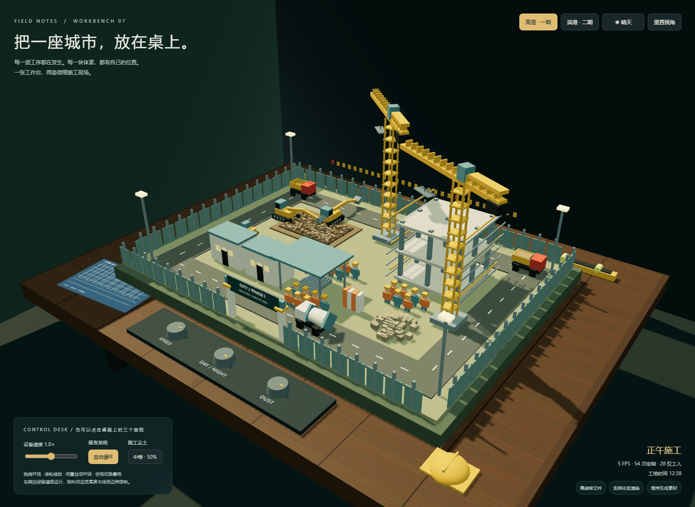

# 工作台 07 · 体素施工沙盘

## 本轮来源

用户指定 **gpt-6.1-sol / max**，明确允许当前会话。当前助手顺序执行，无子代理；模型名称来源为用户。完整用户要求与本题原文见 [prompt.md](prompt.md)。系统完整上下文、前序工具输出和历史缺失的材料未导出，输入标记 partial。

[批次说明](../../../../docs/experiments/gpt-6-1-sol-max/Readme.md) · [校验记录](../../../../docs/experiments/gpt-6-1-sol-max/validation.md) · [校验前首轮完整源码快照](../../../../docs/experiments/gpt-6-1-sol-max/first-complete-sources.zip)

这是一次当前会话的实现记录，不能视作独立会话下的公平性能评测。没有人工修改，所有实现期修复由当前助手完成。

## 场景与模型

高层一期、滨港二期两套场景，共用室内深色实木桌面；程序生成木纹、蓝图、卷尺、安全帽和水平仪。围挡内有挖掘区、钢筋棚、料场、办公板房、在建基座、堆土、围挡与门、道路、警示彩旗、照明及 28 位工人。挖掘机铰接作业、卡车收料/卸料循环、吊车回转吊料、搅拌罐车与小装载机运动。

静态体素与机械的动态方块均使用 InstancedMesh；尘土、雨滴与光晕为 shader。道路预留与分相位车辆调度限制交叉；吊料高度、挖掘臂角度与桌面/场地边界限制机械运行。为限定路线与几何约束的沙盘模拟，未使用通用物理引擎。

## 操作

[index.html](index.html) 单文件直接打开。拖动环视、滚轮缩放、闲置缓慢环绕。点击实体旋钮调整速度、昼夜开关和尘土，或使用界面对应控件。工具栏切换两套场景；空格或暴雨按钮切换雨滴、湿润地面和增强灯光。昼夜为自动循环，也可固定当前时刻。

## 复盘

任务同时写 CDN 与不引用外部资源，本轮内嵌官方 Three.js r160，所有素材程序生成，许可见 [THIRD_PARTY_NOTICES.md](THIRD_PARTY_NOTICES.md)。file:// 阻断全部网络仍可渲染；390px 无溢出。检查第二场景、速度、暴雨、车辆间距与场地边界。

修复内嵌分发代码字符串替换错误，调整桌面支撑、塔吊及工人位置、挖掘动作边界，增加卡车停靠收料/卸料阶段。一次采样绘制次数从 322 降至 54；帧率显示使用真实墙钟增量。没有在真实硬件上证明稳定 60 FPS，也没有证明任意视角下所有局部几何绝无交叠。

## 预览截图

由本 run 登记的最终预览入口在 Chromium 1440 × 1050 桌面视口生成完整页面截图，采用默认初始演示状态。
<!-- archive:start -->
## 当前归档信息（自动生成）

- 实验 ID：`voxel-construction-site--gpt-6-1-sol-max-r01`
- 模型：GPT-6.1 Sol；推理档位：max
- 类型：single-html；预览：static；网络：offline
- [完整原始输入快照](prompt.md) · [主题与其他版本](../../../../topic.html?id=voxel-construction-site)
- 输入记录：保存用户原始要求及基线任务正文；当前会话顺序执行。完整系统上下文与前序工具输出未导出，参见 docs/experiments/gpt-6-1-sol-max。
- 工具：Codex。用户指定 gpt-6.1-sol / max；当前会话直接执行，无子代理。Windows，Node 22.16.0，npm 10.9.2；日期按用户环境上下文。
- 运行方式：浏览器直接打开本目录入口；CDN/外部素材需要联网。
- 费用记录：OpenAI · ChatGPT Plus 订阅；单案例货币金额未记录。据用户说明，OpenAI 模型通过 ChatGPT Plus 订阅测试；全部案例完成后，五小时额度未耗尽。未提供单案例费用金额。
- [主页面](../../../../demos/voxel-construction-site/runs/gpt-6-1-sol-max-r01/index.html)

### 部署适配记录

- 2026-09-30：从空白基线首次实现；按主题最新提示词执行，未获取历史实现。
- 将官方 Three.js r160 分发内嵌到单 HTML，保留 MIT 许可；几何体、纹理、海浪或天气均由代码生成。
- 2026-09-30：修复内嵌库替换，调整场地支撑、吊车/工人位置与机械角度；机械方块实例化，帧率以实际耗时统计；卡车增加收料、卸料停靠及渐变载荷。
- 2026-09-30：根据最终手机截图调整轨道相机取景距离与雾化范围，首次打开呈现完整场景。
<!-- archive:end -->
