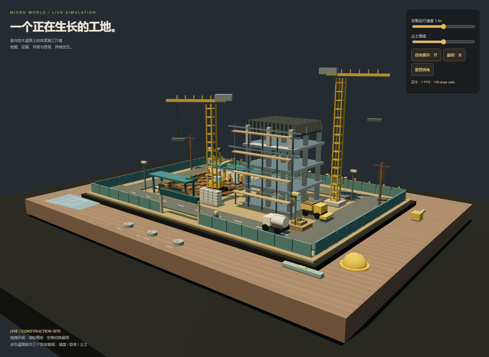

# 体素微缩建筑工地

模型：gpt-6.1-sol；档位：medium；任务版本：v1。当前会话顺序实现，无子代理。

## 输入与边界

见 [原始输入](prompt.md)。保存用户指令、仓库规则和任务正文；其他会话上下文未完整留存。

任务同时要求 Three.js r160 CDN 与不引用外部资源：保留唯一 Three.js CDN 脚本，其余几何、贴图、粒子均代码生成，明确登记需要网络。60FPS 和绝对无穿模属于目标，未作普适保证。

## 运行

联网后直接打开 index.html，或从仓库静态服务器访问。

## 实现与复盘

程序化桌面与工地；静态和动态 cuboid 实例批处理、挖掘机、等待装卸的卡车、罐车、装载机、塔吊、工人、办公室、材料、日夜、暴雨与实体旋钮。修复卡车周期跳变，缩短吊臂以限制边界，调整装车位置。FPS 使用真实帧间隔，动画步长单独限幅。

[首版快照说明](evidence/README.md) · [验证与限制](evidence/validation.md)。首版代码保留，修复没有覆盖首版快照。

## 预览截图

<!-- archive:start -->
## 当前归档信息（自动生成）

- 实验 ID：`voxel-construction-site--gpt-6-1-sol-medium-r01`
- 模型：GPT-6.1 Sol；推理档位：medium
- 类型：single-html；预览：static；网络：required
- [完整原始输入快照](prompt.md) · [主题与其他版本](../../../../topic.html?id=voxel-construction-site)
- 输入记录：保存用户本轮原始请求、仓库规则与读取的任务原文。当前会话逐个执行，并非独立会话；系统/开发者上下文、工具输出及前序案例上下文未逐字复制，不能视为独立同输入评测。
- 工具：Codex。Windows PowerShell / Node 22.16.0；当前会话执行，无子代理。模型 gpt-6.1-sol、档位 medium 由用户明确指定。默认选择各主题最大提示词版本。未读取其他分支、工作目录或远程历史实现。 验证：Chromium headless（WebGL 使用 SwiftShader）；实际摄像头手势与实体设备帧率未验证。
- 运行方式：浏览器直接打开本目录入口；CDN/外部素材需要联网。
- 费用记录：OpenAI · ChatGPT Plus 订阅；单案例货币金额未记录。据用户说明，OpenAI 模型通过 ChatGPT Plus 订阅测试；全部案例完成后，五小时额度未耗尽。未提供单案例费用金额。
- [体素微缩建筑工地](../../../../demos/voxel-construction-site/runs/gpt-6-1-sol-medium-r01/index.html)

### 部署适配记录

- 任务同时要求 Three.js r160 CDN 与不引用外部资源：保留唯一 Three.js CDN 脚本，其余几何、贴图、粒子均代码生成，明确登记需要网络。60FPS 和绝对无穿模属于目标，未作普适保证。
- 程序化桌面与工地；静态和动态 cuboid 实例批处理、挖掘机、等待装卸的卡车、罐车、装载机、塔吊、工人、办公室、材料、日夜、暴雨与实体旋钮。修复卡车周期跳变，缩短吊臂以限制边界，调整装车位置。FPS 使用真实帧间隔，动画步长单独限幅。
<!-- archive:end -->
