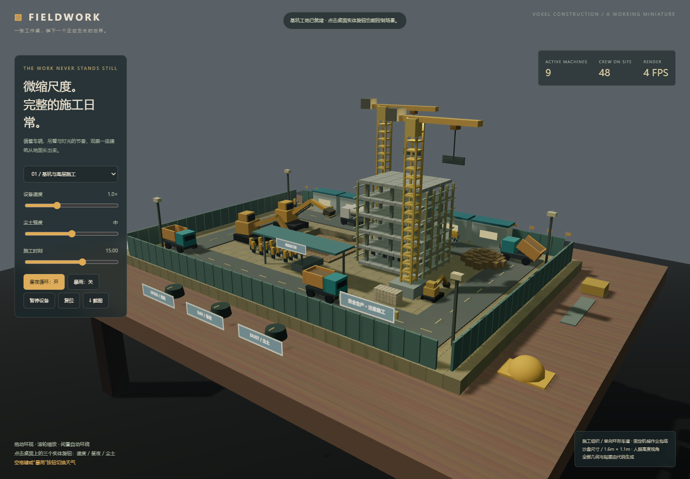

# 体素微缩建筑工地 · 自主设计版

## 本轮设计授权

> 允许你理解输入的需求，针对需求进行优化，按照你理解的更好的设计，进行具体的开发实现。

本轮标记为 **自主设计版 / design-enhanced**。原任务使用 v1，正文未改写。完整输入见 [prompt.md](prompt.md)，结构化授权与设计记录见 [design-scope.json](design-scope.json)。不能与未包含授权的旧实验标记为原始输入一致。

## 设计决策

以实体工作桌为载体提供基坑施工与装配吊装两套沙盘；分配独立作业区和单向车道，机械状态随时间联动。

## 执行条件

用户指定 gpt-6.1-sol，xhigh；在当前 Codex 会话直接执行，无子代理、无人工代码修改。同一会话连续完成多个主题，未保存全部系统上下文，不声明独立会话或公平性能比较。日期：2026-10-09。

## 运行与验证

用浏览器直接打开 [index.html](index.html)，或从仓库静态服务器进入。无后端、CDN 或远程素材，可离线直接打开。

## 需求解释与实现边界

正文同时要求 Three.js r160 CDN 与不引用外部资源；下载指定版本后内嵌库，保留许可，最终单 HTML 无运行时外部依赖。60FPS 为设计目标，实际性能依赖 GPU。固定机械包络、车辆间距和单向车道降低碰撞风险，不声称通用物理碰撞引擎。

## 技术来源

- [Three.js r160 source](https://cdn.jsdelivr.net/npm/three@0.160.0/build/three.min.js)
- [InstancedMesh 官方文档](https://threejs.org/docs/pages/InstancedMesh.html)

## 首次产物与验证证据

- [首次源码快照](evidence/first-artifact.zip) · [快照 SHA-256](evidence/first-artifact.json)。快照在浏览器校验前保存，含当时源码、输入和元数据，不包含依赖或中间 dist。
- [桌面截图](evidence/index-desktop.png) · [390px 截图](evidence/index-mobile.png) · [验证明细](evidence/validation.json)。
- 本案例 6 项关键功能检查通过，1 个登记入口在根路径、Pages 子路径与 390px 布局中通过。直接打开检查见验证明细。
- 全仓维护检查：generate、validate、npm test（11/11）、node --check index.js、test:browser（12/12）、git diff --check。

### 首次交付中的修复

- 内嵌库时 String.replace 的替换字符串将库内美元符号解释为替换指令，导致脚本语法错误。 按明确脚本边界拼接原始库字节，避免替换字符串展开。
- 浏览器检查发现软件渲染帧率较低，脚手架横杆过厚、基坑未真实凹下，部分工人站位与楼板接触。 增加动态方块实例批渲染、低帧率自动降低质量；重做凹陷地形、脚手架与作业站位，增加工人手臂与工具动作、夜灯光晕着色器，调整渣土堆和装载机作业区。

### 已知边界

- SwiftShader 软件渲染观察为 2–6FPS，自动降至 0.75 像素比并关闭阴影；没有达到 60FPS，硬件 GPU 性能待实机测量。车辆路径与间距经过 90 秒模拟检查，未穷举所有几何碰撞。

## 预览截图

<!-- archive:start -->
## 当前归档信息（自动生成）

- 实验 ID：`voxel-construction-site--gpt-6-1-sol-xhigh-r01`
- 模型：GPT-6.1 Sol；推理档位：xhigh
- 执行模式：自主设计授权；授权原文：允许你理解输入的需求，针对需求进行优化，按照你理解的更好的设计，进行具体的开发实现。
- 类型：single-html；预览：static；网络：offline
- [完整原始输入快照](prompt.md) · [主题与其他版本](../../../../topic.html?id=voxel-construction-site)
- 输入记录：保存本轮用户原文与所选任务正文；允许理解并优化需求和设计，区别于原文严格执行轮次。当前会话连续执行，系统上下文未完整归档。
- 工具：Codex。用户指定 gpt-6.1-sol / xhigh；Windows / PowerShell，当前会话直接执行，无子代理。模型名称按用户声明记录，未调用独立模型 API 验证。使用同一会话完成全部参与主题，存在前序实现上下文。 浏览器验证使用 Chromium 145.0.7632.6；3D 最终验证使用 ANGLE SwiftShader 软件渲染。
- 运行方式：浏览器直接打开本目录入口；CDN/外部素材需要联网。
- 费用记录：OpenAI · ChatGPT Plus 订阅；单案例货币金额未记录。据用户说明，OpenAI 模型通过 ChatGPT Plus 订阅测试；全部案例完成后，五小时额度未耗尽。未提供单案例费用金额。
- [打开案例](../../../../demos/voxel-construction-site/runs/gpt-6-1-sol-xhigh-r01/index.html)

### 部署适配记录

- 本轮新增授权：允许理解输入需求、优化需求并按更好的设计实现；任务正文版本与 hash 保持原样。
- 以实体工作桌为载体提供基坑施工与装配吊装两套沙盘；分配独立作业区和单向车道，机械状态随时间联动。
- 本轮由模型直接生成，无人工代码修改；校验后的修复另行记录。
- 正文同时要求 Three.js r160 CDN 与不引用外部资源；下载指定版本后内嵌库，保留许可，最终单 HTML 无运行时外部依赖。60FPS 为设计目标，实际性能依赖 GPU。固定机械包络、车辆间距和单向车道降低碰撞风险，不声称通用物理碰撞引擎。
- 首次交付校验修复：内嵌库时 String.replace 的替换字符串将库内美元符号解释为替换指令，导致脚本语法错误。 按明确脚本边界拼接原始库字节，避免替换字符串展开。
- 首次交付校验修复：浏览器检查发现软件渲染帧率较低，脚手架横杆过厚、基坑未真实凹下，部分工人站位与楼板接触。 增加动态方块实例批渲染、低帧率自动降低质量；重做凹陷地形、脚手架与作业站位，增加工人手臂与工具动作、夜灯光晕着色器，调整渣土堆和装载机作业区。
<!-- archive:end -->
