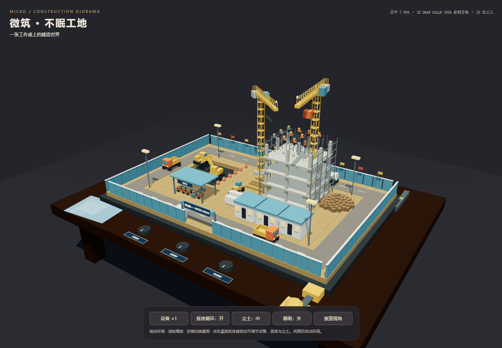

# 体素微缩建筑工地 · GPT 6 Astra xhigh

## 原始输入与执行条件

见 [完整输入快照](prompt.md)。任务正文采用 v1。用户指定模型 gpt-6-astra、档位 xhigh；在当前会话直接执行，没有委派子代理。11 个活跃案例共享会话上下文，不能视为隔离的独立同题测评。

## 运行

联网直接打开 index.html。可点击桌面三个实体旋钮，也可使用屏幕按钮；空格或暴雨按钮切换天气。

## 实现与复盘

Three.js r160 为唯一外部库。桌面木纹、图纸、标牌、所有几何体与材质均由代码生成。静态体素实例化；车辆沿专用环路并保留车距、塔吊分高度运行。60FPS 为目标，本次软件渲染截图约 7–8FPS，未达到或证明稳定 60FPS；机械姿态碰撞未穷举。实际性能取决于设备；不能把双开对比视为单项目性能测试。

## 验证

已完成 HTTP、390px 无水平溢出及页面脚本检查；案例功能检查与实际数值见[本轮总报告](../../../../docs/model-tests/2026-10-08-gpt-6-astra-xhigh/Readme.md)和[验收结果](../../../../docs/model-tests/2026-10-08-gpt-6-astra-xhigh/verification.json)。首次代码保存在[首次产物 ZIP](../../../../docs/model-tests/2026-10-08-gpt-6-astra-xhigh/first-output/voxel-construction-site.zip)，首次定稿前的修正见 run.json 的 changes。

## API 参考

[Three.js 官方文档](https://threejs.org/docs/)。仅查询库文档，没有读取历史实验实现。

## 预览截图

<!-- archive:start -->
## 当前归档信息（自动生成）

- 实验 ID：`voxel-construction-site--gpt-6-astra-xhigh-r02`
- 模型：GPT-6 Astra；推理档位：xhigh
- 类型：single-html；预览：static；网络：required
- [完整原始输入快照](prompt.md) · [主题与其他版本](../../../../topic.html?id=voxel-construction-site)
- 输入记录：保留用户本轮原文、仓库规则快照及所选任务原文。当前会话顺序完成全部活跃主题，共享上下文；系统/开发者消息和全部工具输出未复制，不能视为独立同输入测评。
- 工具：Codex。Windows / PowerShell；用户指定模型 gpt-6-astra、档位 xhigh；按用户要求沿用当前会话和当前基线目录。单代理直接执行；未读取其他分支、远程或工作目录的历史实现。版本选择：数字最大的可用版本。
- 运行方式：浏览器直接打开本目录入口；CDN/外部素材需要联网。
- [主页面](../../../../demos/voxel-construction-site/runs/gpt-6-astra-xhigh-r02/index.html)

### 部署适配记录

- 本轮从空白基线首次实现；没有人工修改。
- 任务同时要求 Three.js r160 CDN 与无外部资源；解释为仅允许 Three.js 库 CDN，几何体、材质和纹理全部代码生成。
- 首次定稿前检查：分开两台挖掘机作业行，调整挖掘姿态；增加动态方块实例批次减少绘制调用。 首次文件保存在 docs/model-tests/2026-10-08-gpt-6-astra-xhigh/first-output/voxel-construction-site.zip；无新增用户提示或人工修改。
- 迁入 main 时发现该主题已有 2026-09-16 的 gpt-6-astra-xhigh-r01；保留原实验，本次记录号调整为 r02，源码与原始输入未改动。
<!-- archive:end -->
