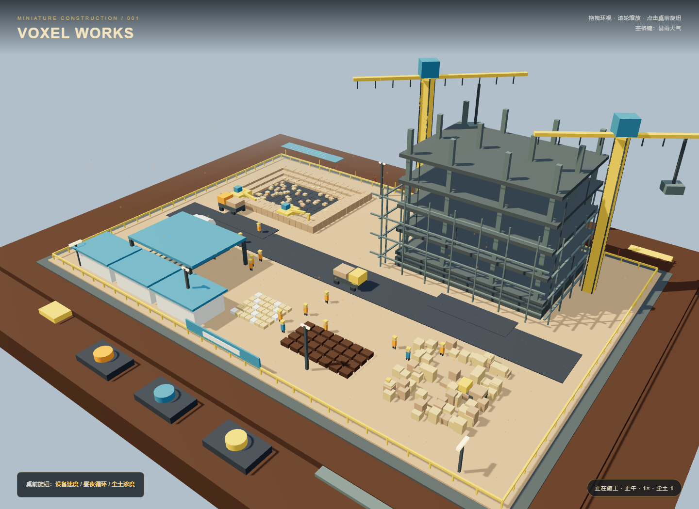

# 体素微缩建筑工地

## 原始提示词

见 [完整原始输入](prompt.md)。本轮使用 v1 任务正文。

## 运行与复盘

直接在 Chrome 打开 `index.html`。`index.html` 是完整离线产物，已内联 Three.js r160；源码为 `scene.js`，运行 `npm ci && npm run build` 可重新生成。拖拽环视、滚轮缩放；点击桌前从左到右的旋钮调整速度、昼夜循环、尘土，空格切换暴雨。60FPS 与完全无穿模尚未在目标设备实测，不作性能保证。

模型名称和档位由用户指定为 gpt-6-sol / medium；工具是当前 Codex 会话。运行环境未提供可独立核验的模型标识。

## 预览截图

<!-- archive:start -->
## 当前归档信息（自动生成）

- 实验 ID：`voxel-construction-site--gpt-6-sol-medium-r01`
- 模型：GPT-6 Sol；推理档位：medium
- 类型：single-html；预览：static；网络：offline
- [完整原始输入快照](prompt.md) · [主题与其他版本](../../../../topic.html?id=voxel-construction-site)
- 输入记录：本轮按存档任务正文原文执行。 本轮由用户统一指定全部主题、模型名 gpt-6-sol、medium 档位及当前会话执行。
- 工具：Codex 当前会话。用户指定模型名称 gpt-6-sol、档位 medium；运行环境未提供可独立核验的模型标识。未委派子代理。
- 运行方式：浏览器直接打开本目录入口；CDN/外部素材需要联网。
- [预览](../../../../demos/voxel-construction-site/runs/gpt-6-sol-medium-r01/index.html)

### 部署适配记录

- 首次生成，无人工修改历史产物。
- 原文同时要求 Three.js r160 CDN 和不引用任何外部资源；最终 HTML 内联打包 Three.js r160，优先满足无外部资源。
<!-- archive:end -->
