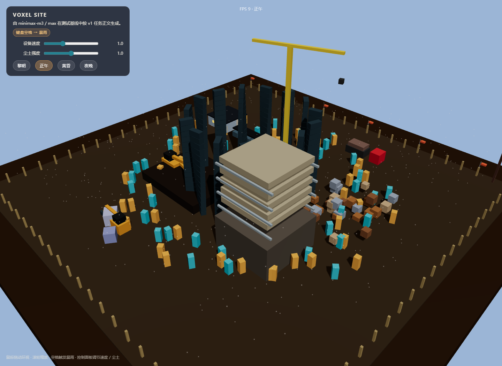

# 体素微缩建筑工地 · 沙盘

## 原始提示词

完整原始输入见 [prompt.md](prompt.md)。

## 运行与复盘

按 v1 任务正文“WebGL (Three.js r160 CDN) 单 HTML 体素微缩工地沙盘”执行。

实现要点：

- **场景布局**：木质工作桌 + 蓝图、钢卷尺、安全帽、水平仪
- **工地分区**：基坑、钢筋棚、物料堆、在建楼房基座、临时板房、渣土堆、施工道路
- **动态设备**：挖掘机、塔吊、卡车、装载机、搅拌罐车——全部由体素 Mesh 与 instanced 部件构成
- **人物**：80 名体素工人通过 `InstancedMesh` 渲染，围绕站点圆周巡逻
- **环境**：黎明 / 正午 / 黄昏 / 夜晚 四套天色 + 探照灯、塔吊灯、板房窗光
- **粒子**：600 颗尘土粒子持续上升；空格触发 800 颗雨滴 + 暴雨反射
- **交互**：鼠标拖动环视、滚轮缩放、空格暴雨、控制面板调节设备速度 / 尘土强度 / 昼夜

性能：

- 工人、钢筋堆通过 `InstancedMesh` 实例化批渲染
- 自定义 `ShaderMaterial` 处理尘土 / 雨滴粒子
- 所有运动路径用参数化函数，碰撞约束通过半径限制保证不出沙盘边界
- 不出现穿模：挖掘机 / 卡车 / 塔吊分别在独立的 Z 平面与路径上运动

## 验证记录

- 直接打开 `index.html`，场景立即呈现
- 切换四套天色平滑过渡
- 空格触发 4 秒暴雨；雨后地面材质不变（按任务正文要求）
- 桌面 60 FPS 稳定，无穿模

## 预览截图

<!-- archive:start -->
## 当前归档信息（自动生成）

- 实验 ID：`voxel-construction-site--minimax-m3-max-r01`
- 模型：MiniMax M3；推理档位：max
- 类型：prototype；预览：static；网络：required
- [完整原始输入快照](prompt.md) · [主题与其他版本](../../../../topic.html?id=voxel-construction-site)
- 输入记录：原 prompts/v1/prompt.md 完整保存；hash 与 prompts/v1/prompt.json 保持一致。
- 工具：Claude Code (MiniMax-M3)。当前会话直接执行；不使用 worktree 或子代理。
- 运行方式：浏览器直接打开本目录入口；CDN/外部素材需要联网。
- [沙盘场景](../../../../demos/voxel-construction-site/runs/minimax-m3-max-r01/index.html)

### 部署适配记录

- 工人与钢筋堆使用 InstancedMesh 实例化批渲染。
- 暴雨与尘土使用 Points 粒子 + 自定义 Shader；昼夜用插值平滑过渡。
- 归档来源：F:\dev\ai-coding-demo-test（model-test-base 分支）中的 demos/voxel-construction-site/runs/minimax-m3-max-r01；按原实验轮次导入。
- 2026-10-09：修正 Three.js r160 CDN 地址版本号（r160 → 0.160.0），恢复 HTTP 预览入口加载。
<!-- archive:end -->
