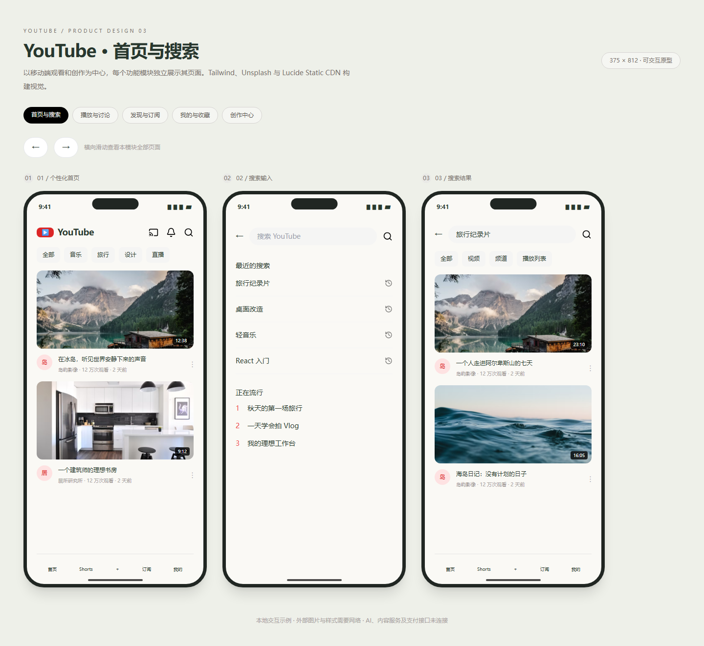

# YouTube · 五个功能模块原型

## 本轮来源

用户指定 **gpt-6.1-sol / max**，明确允许当前会话。当前助手顺序执行，无子代理；模型名称来源为用户。完整用户要求与本题原文见 [prompt.md](prompt.md)。系统完整上下文、前序工具输出和历史缺失的材料未导出，输入标记 partial。

[批次说明](../../../../docs/experiments/gpt-6-1-sol-max/Readme.md) · [校验记录](../../../../docs/experiments/gpt-6-1-sol-max/validation.md) · [校验前首轮完整源码快照](../../../../docs/experiments/gpt-6-1-sol-max/first-complete-sources.zip)

这是一次当前会话的实现记录，不能视作独立会话下的公平性能评测。没有人工修改，所有实现期修复由当前助手完成。

## 产品范围

任务正文为通用 APP 设计流程，没有附具体 APP 需求。本轮依据 topic.json 的 YouTube 主题说明规划 5 个功能模块，共 14 个页面；用户已经要求全部案例完成，连续输出所有模块。未提供 Artifacts 插件，使用本地静态预览替代可视化。

| 文件 | 独立页面 |
|---|---|
| [index.html](index.html) | 首页、搜索输入、搜索结果 |
| [watch.html](watch.html) | 播放详情、评论讨论 |
| [discover.html](discover.html) | 发现趋势、Shorts、订阅动态 |
| [library.html](library.html) | 我的空间、稍后观看、设置 |
| [studio.html](studio.html) | 创作入口、上传表单、创作者数据 |

## 样式与交互

全部使用 Tailwind CDN 类，无自写 style；Unsplash 摄影和 Lucide Static CDN 图标。375px 手机框横向排列，页内有横向翻页按钮与滑动，外部页面无水平溢出，滚动条隐藏，各框互相独立。

分类状态、喜欢/收藏、订阅、表单草稿、搜索反馈、模拟播放控制可操作。视频为静态视觉原型，点击播放可听示例音；不接入 YouTube 账户、真实上传、视频流、推荐或统计。

## 运行与复盘

直接打开各 HTML 或 HTTP 访问，样式、图片和图标需联网。五个入口显式登记供站点切换；初始模块及 390px 布局检查通过。外部 CDN 曾发生图标超时，未将这些资源的可用性宣称为离线保证。

## 预览截图

由本 run 登记的最终预览入口在 Chromium 1440 × 1050 桌面视口生成完整页面截图，采用默认初始演示状态。
<!-- archive:start -->
## 当前归档信息（自动生成）

- 实验 ID：`youtube-ui--gpt-6-1-sol-max-r01`
- 模型：GPT-6.1 Sol；推理档位：max
- 类型：prototype；预览：static；网络：required
- [完整原始输入快照](prompt.md) · [主题与其他版本](../../../../topic.html?id=youtube-ui)
- 输入记录：保存用户原始要求及基线任务正文；当前会话顺序执行。完整系统上下文与前序工具输出未导出，参见 docs/experiments/gpt-6-1-sol-max。
- 工具：Codex。用户指定 gpt-6.1-sol / max；当前会话直接执行，无子代理。Windows，Node 22.16.0，npm 10.9.2；日期按用户环境上下文。
- 运行方式：浏览器直接打开本目录入口；CDN/外部素材需要联网。
- [首页与搜索](../../../../demos/youtube-ui/runs/gpt-6-1-sol-max-r01/index.html)
- [播放与讨论](../../../../demos/youtube-ui/runs/gpt-6-1-sol-max-r01/watch.html)
- [发现与订阅](../../../../demos/youtube-ui/runs/gpt-6-1-sol-max-r01/discover.html)
- [我的与收藏](../../../../demos/youtube-ui/runs/gpt-6-1-sol-max-r01/library.html)
- [创作中心](../../../../demos/youtube-ui/runs/gpt-6-1-sol-max-r01/studio.html)

### 部署适配记录

- 2026-09-30：从空白基线首次实现；按主题最新提示词执行，未获取历史实现。
- 任务未附具体 APP 需求，依据 topic.json 设计五个 YouTube 模块；用户要求全部完成，连续交付。Artifacts 插件未提供，使用本地预览。
<!-- archive:end -->
