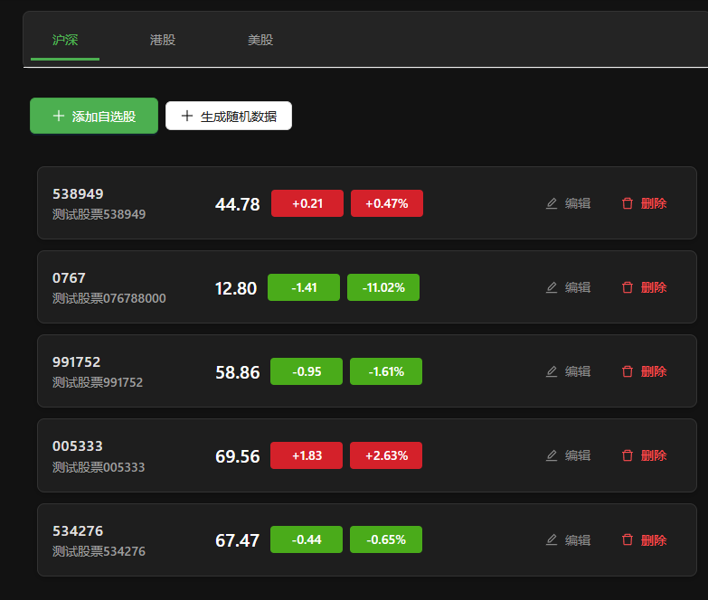
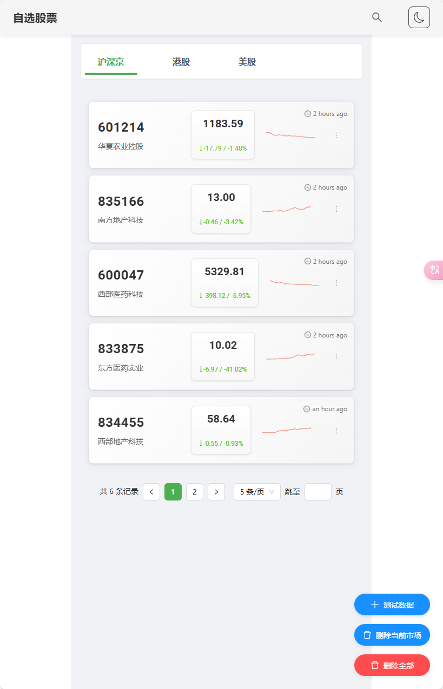
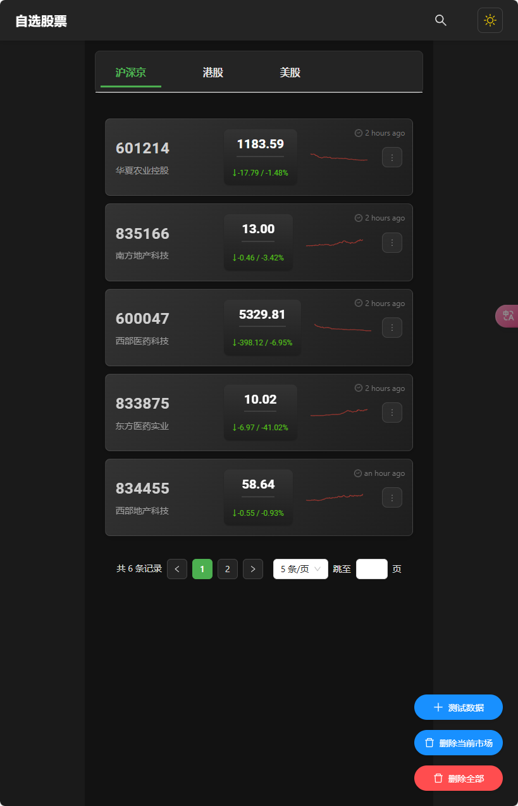

# Trae 股票自选系统

## 项目概述

本项目是一个基于 React + Golang 的股票自选系统，支持股票的增删改查操作，并提供基础行情数据展示功能。系统采用前后端分离架构，具有良好的可扩展性和维护性。

### 项目特点

- **前后端分离**：React + TypeScript 前端，Golang + Gin 后端
- **数据库支持**：使用 PostgreSQL 17 作为数据存储
- **跨域支持**：完整的 CORS 配置，支持开发和生产环境
- **容器化部署**：完整的 Docker 部署方案
- **日志记录**：前后端完整的请求日志记录

### Prompt

项目是从零开始创建，下面是项目的 Prompt：

```shell
基于项目原型图，开发功能：自选股，需要支持合约的新增、删除、修改、查询。自选股界面需要展示基础的行情数据。支持多个不同的市场切换。

前端：react
后端：golang gin gorm
数据库：PostgreSQL

服务端需要支持跨域请求，同时需要考虑数据的校验和错误处理，如果后端服务不可用，前端需要告警提示。

后端需要展示请求和应答的日志；前端也打印通讯的日志，方便排查问题。
```

### UI 和交互优化

前端界面的设计完全依赖的 Grok，我们首先在 Trae 里面做出来产物的雏形，但是没有审美，由于使用的模型，代码能力很强，但是其他能力比较弱，所以我们需要使用 Grok 来优化前端的 UI。

通过将当前的界面截图，上传到 Grok 里面，然后让它帮我们优化 UI，可能一次性拿到很多的优化建议，我们人工评估，然后拷贝到 Trae 中执行，观察优化的效果。

最初的版本，很有工程师的味道，功能都在，但是交互逻辑比较简单直观。



优化后，我们更加贴近了用户的使用场景，实际部署，你会发现，交互上也多了很多细节，动画效果更加完善。





### 技术栈

- **前端**：React + TypeScript
- **后端**：Golang + Gin + GORM
- **数据库**：PostgreSQL 17
- **部署**：Docker + Nginx

## 📚 文档索引

- [📖 开发指南](docs/development.md) - 本地开发环境搭建和开发流程
- [🚀 部署指南](docs/deployment.md) - 生产环境部署和配置
- [API 文档](docs/api.md) - 接口说明文档
- [数据库设计](docs/database.md) - 数据库表结构设计
- [错误码说明](docs/error_codes.md) - 错误码及解决方案

## 已知问题

* 由于使用国外的 AI 模型，Vue3 + Element-Plus 的训练数据不足，因此选择了 React 作为前端框架
* 可能存在偶发的语法错误，需要人工修复
* 部分复杂问题的解决方案需要人工指引
* 代码结构优化需要人工指导
